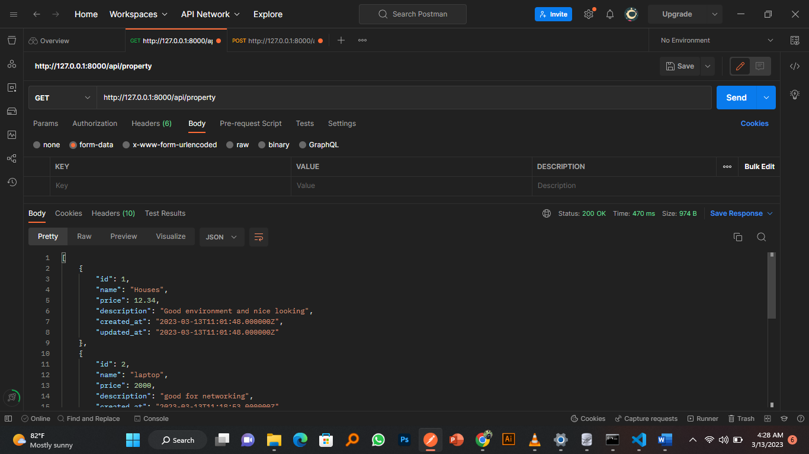
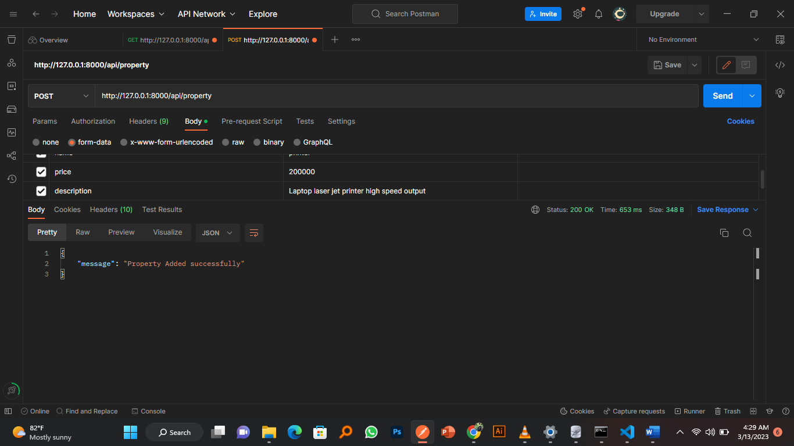

##LARAVEL 10 API DEVELOPMENT 
Laravel is a PHP framework developed with developer productivity in mind.  
Written and maintained by Taylor Otwell, the framework is very opinionated and strives to save developer time by favoring convention over configuration. 
The framework also aims to evolve with the web and has already incorporated several new features and ideas in the web development world—such as job queues, API authentication out of the box, real-time communication, and much more.
 
For more inforation visit https://laravel.com/
 
Screen shots
Fetching all properties  

 
Inserting   

Deleting a property 

